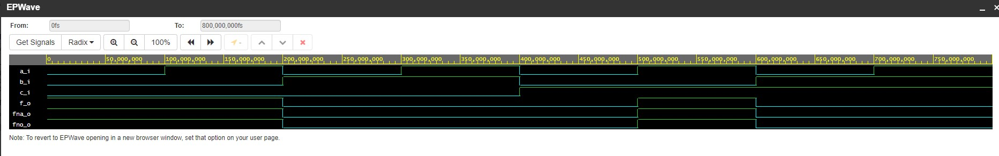
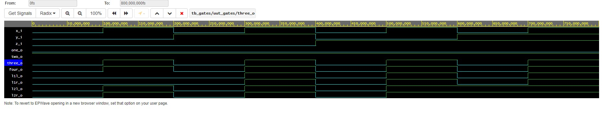

# Labs/01-gates

## De Morgan's Laws

### Function Table
| **c** | **b** |**a** | **f(c,b,a)** |
| :-: | :-: | :-: | :-: |
| 0 | 0 | 0 | 1 |
| 0 | 0 | 1 | 1 |
| 0 | 1 | 0 | 0 |
| 0 | 1 | 1 | 0 |
| 1 | 0 | 0 | 0 |
| 1 | 0 | 1 | 1 |
| 1 | 1 | 0 | 0 |
| 1 | 1 | 1 | 0 |

<br>

### Picture


<br>

### Code
```vhdl
------------------------------------------------------------------------
--
-- Example of basic OR, AND, XOR gates.
-- Nexys A7-50T, Vivado v2020.1, EDA Playground
--
-- Copyright (c) 2019-2020 Tomas Fryza
-- Dept. of Radio Electronics, Brno University of Technology, Czechia
-- This work is licensed under the terms of the MIT license.
--
------------------------------------------------------------------------

library ieee;               -- Standard library
use ieee.std_logic_1164.all;-- Package for data types and logic operations

------------------------------------------------------------------------
-- Entity declaration for basic gates
------------------------------------------------------------------------
entity gates is
    port(
        a_i    : in  std_logic;         -- Data input
        b_i    : in  std_logic;         -- Data input
        c_i    : in  std_logic;         -- Data input
        f_o    : out std_logic;         -- OR output function
        fna_o  : out std_logic;         -- NAND output function
        fno_o  : out std_logic          -- NOR output function
        --for_o  : out std_logic;         -- OR output function
        --fand_o : out std_logic;         -- AND output function
        --fxor_o : out std_logic          -- XOR output function
    );
end entity gates;

------------------------------------------------------------------------
-- Architecture body for basic gates
------------------------------------------------------------------------
architecture dataflow of gates is
begin
    f_o    <= ((not b_i) and a_i) or ((not c_i) and (not b_i));
    fna_o  <= ((b_i nand b_i) nand a_i) nand ((c_i nand c_i) nand (b_i nand b_i));
    fno_o  <= (((a_i nor a_i) nor b_i) nor (b_i nor c_i)) nor (((a_i nor a_i) nor b_i) nor (b_i nor c_i));
    --for_o  <= a_i or b_i;
    --fand_o <= a_i and b_i;
    --fxor_o <= a_i xor b_i;

end architecture dataflow;
```

<br>

### Link
[EDA Plauground](https://www.edaplayground.com/x/bSsu)

<br>

## Distributive Functions

### Code
```vhdl
-- Code your design here
library IEEE;
use IEEE.std_logic_1164.all;

------------------------------------------------------------------------
-- Entity declaration for basic gates
------------------------------------------------------------------------
entity gates is
	port(
    	x_i		: in  std_logic;		-- Data input
        y_i		: in  std_logic;		-- Data input
        z_i		: in  std_logic;		-- Data input
        
        one_o	: out std_logic;		-- First postulate
        two_o	: out std_logic;		-- Second postulate
        three_o : out std_logic;		-- Third postulate
        four_o  : out std_logic;		-- Fourth postulate
        
        l1l_o   : out std_logic;		-- Left part of the first law equation
        l1r_o   : out std_logic;		-- Right part of the first law equation
        l2l_o   : out std_logic;		-- Left part of the second law equation
        l2r_o   : out std_logic			-- Right part of the second law equation
    );
end entity gates; 

------------------------------------------------------------------------
-- Architecture body for basic gates
------------------------------------------------------------------------
architecture dataflow of gates is 
begin
    one_o	<= x_i and not(x_i);
    two_o	<= x_i or not(x_i);
    three_o	<= x_i or x_i or x_i;
    four_o	<= x_i and x_i and x_i;
    
    l1l_o	<= (x_i and y_i) or (x_i and z_i);
    l1r_o	<= x_i and (y_i or z_i);
    l2l_o	<= (x_i or y_i) and (x_i or z_i);
    l2r_o	<= x_i or (y_i and z_i);
    
end architecture dataflow;
```

<br>

### Picture


<be>

### Link
[EDA Plauground](https://www.edaplayground.com/x/WAYT)

