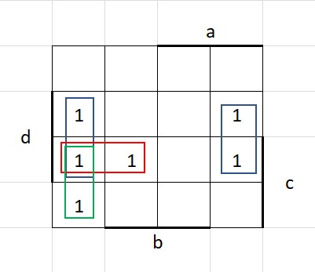
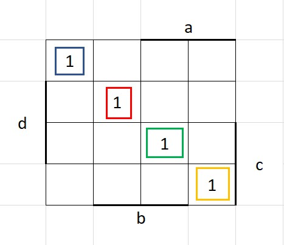
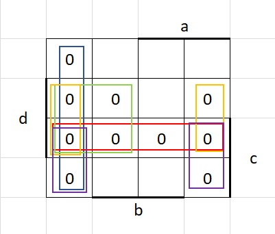
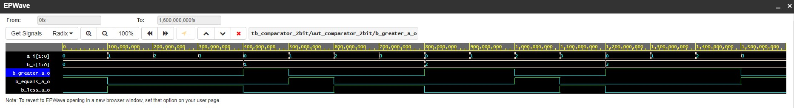
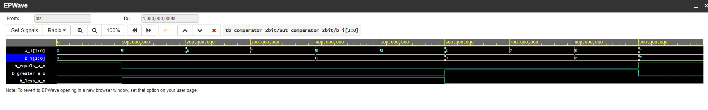

# Labs/01-gates

## GitHub Link
[GitHub - Daniel Havránek (Dan5049)](https://github.com/Dan5049/Digital-electronics-1)

<br>

## Truth table

| **Dec. equivalent** | **d** | **c** | **b** | **a** | **B[1:0]** | **A[1:0]** | **B is greater than A** | **B equals A** | **B is less than A** |
| :-: | :-: | :-: | :-: | :-: | :-: | :-: | :-: | :-: | :-: | 
| 0 | 0 | 0 | 0 | 0 | 0 0 | 0 0 | 0 | 1 | 0 |
| 1 | 0 | 0 | 0 | 1 | 0 0 | 0 1 | 0 | 0 | 1 |
| 2 | 0 | 0 | 1 | 0 | 0 0 | 1 0 | 0 | 0 | 1 |
| 3 | 0 | 0 | 1 | 1 | 0 0 | 1 1 | 0 | 0 | 1 |
| 4 | 0 | 1 | 0 | 0 | 0 1 | 0 0 | 1 | 0 | 0 |
| 5 | 0 | 1 | 0 | 1 | 0 1 | 0 1 | 0 | 1 | 0 |
| 6 | 0 | 1 | 1 | 0 | 0 1 | 1 0 | 0 | 0 | 1 |
| 7 | 0 | 1 | 1 | 1 | 0 1 | 1 1 | 0 | 0 | 1 |
| 8 | 1 | 0 | 0 | 0 | 1 0 | 0 0 | 1 | 0 | 0 |
| 9 | 1 | 0 | 0 | 1 | 1 0 | 0 1 | 1 | 0 | 0 |
| 10 | 1 | 0 | 1 | 0 | 1 0 | 1 0 | 0 | 1 | 0 |
| 11 | 1 | 0 | 1 | 1 | 1 0 | 1 1 | 0 | 0 | 1 |
| 12 | 1 | 1 | 0 | 0 | 1 1 | 0 0 | 1 | 0 | 0 |
| 13 | 1 | 1 | 0 | 1 | 1 1 | 0 1 | 1 | 0 | 0 |
| 14 | 1 | 1 | 1 | 0 | 1 1 | 1 0 | 1 | 0 | 0 |
| 15 | 1 | 1 | 1 | 1 | 1 1 | 1 1 | 0 | 1 | 0 |

<br>

_equals_SoP = !a!b!c!d + !dc!ba + d!cb!a + dcba_


_less_SoP = (d+c+b+a) (d+!c+b+a) (d+!c+b+!a) (!d+c+b+a) (!d+c+b+!a) (!d+c+!b+a) (!d+!c+b+a) (!d+!c+b+!a) (!d+!c+!b+a) (!d+!c+!b+!a)_

<br>

## Logic function minimization

<br>

### Greater - SoP


<br>

_greater_SoP_min = d!b + dc!a + c!b!a_

<br>

### Equal


<br>

_equals_SoP = !d!c!b!a + d!cb!a + dcba + !dc!ba_

### Less - PoS


<br>

_less_PoS_min = (b+a) (!d+!c) (!d+a) (!d+b) (!c+b)_

<br>

## 2-bit comparator
### 2-bit EP Wave 


<br>

[EDA 2-bit comparator](https://www.edaplayground.com/x/gsc9)

<br>

## 4-bit comparator
### 4-bit EP Wave


<br>

### VHDL design code
```
library ieee;
use ieee.std_logic_1164.all;

------------------------------------------------------------------------
-- Entity declaration for 4-bit binary comparator
------------------------------------------------------------------------
entity comparator_4bit is
    port(
        a_i           : in  std_logic_vector(4 - 1 downto 0);
        b_i           : in  std_logic_vector(4 - 1 downto 0);


        -- COMPLETE ENTITY DECLARATION


        B_less_A_o    : out std_logic;       -- B is less than A
        B_greater_A_o : out std_logic;		 -- B is greater than A
        B_equals_A_o  : out std_logic		 -- B is egual than A
    );
end entity comparator_4bit;

------------------------------------------------------------------------
-- Architecture body for 4-bit binary comparator
------------------------------------------------------------------------
architecture Behavioral of comparator_4bit is
begin
    B_less_A_o    <= '1' when (b_i < a_i) else '0';
    B_greater_A_o <= '1' when (b_i > a_i) else '0';
	B_equals_A_o  <= '1' when (b_i = a_i) else '0';

    -- WRITE "GREATER" AND "EQUALS" ASSIGNMENTS HERE


end architecture Behavioral;
```
### VHDL testbench code
```
library ieee;
use ieee.std_logic_1164.all;

------------------------------------------------------------------------
-- Entity declaration for testbench
------------------------------------------------------------------------
entity tb_comparator_4bit is
    -- Entity of testbench is always empty
end entity tb_comparator_4bit;

------------------------------------------------------------------------
-- Architecture body for testbench
------------------------------------------------------------------------
architecture testbench of tb_comparator_4bit is

    -- Local signals
    signal s_a       : std_logic_vector(4 - 1 downto 0);
    signal s_b       : std_logic_vector(4 - 1 downto 0);
    signal s_B_greater_A : std_logic;
    signal s_B_equals_A  : std_logic;
    signal s_B_less_A    : std_logic;

begin
    -- Connecting testbench signals with comparator_4bit entity (Unit Under Test)
    uut_comparator_4bit : entity work.comparator_4bit
        port map(
            a_i           => s_a,
            b_i           => s_b,
            B_greater_A_o => s_B_greater_A,
            B_equals_A_o  => s_B_equals_A,
            B_less_A_o    => s_B_less_A
        );

    --------------------------------------------------------------------
    -- Data generation process
    --------------------------------------------------------------------
    p_stimulus : process
    begin
        -- Report a note at the begining of stimulus process
        report "Stimulus process started" severity note;


        -- First test values
        s_b <= "0000"; s_a <= "0000"; wait for 100 ns;
        -- Expected output
        assert ((s_B_greater_A = '0') and (s_B_equals_A = '1') and (s_B_less_A = '0'))
        -- If false, then report an error
        report "Test failed for input combination: 0000, 0000" severity error;
        
        
        -- WRITE OTHER TESTS HERE
        s_b <= "0000"; s_a <= "0101"; wait for 100 ns;
        -- Expected output
        assert ((s_B_greater_A = '0') and (s_B_equals_A = '0') and (s_B_less_A = '1'))
        -- If false, then report an error
        report "Test failed for input combination: 0000, 0101" severity error;
        
        --ERROR
         s_b <= "0000"; s_a <= "1010"; wait for 100 ns;
        -- Expected output
        assert ((s_B_greater_A = '0') and (s_B_equals_A = '1') and (s_B_less_A = '0'))
        -- If false, then report an error
        report "Test failed for input combination: 0000, 1010 (intentional)" severity error;

 		s_b <= "0000"; s_a <= "1111"; wait for 100 ns;
        -- Expected output
        assert ((s_B_greater_A = '0') and (s_B_equals_A = '0') and (s_B_less_A = '1'))
        -- If false, then report an error
        report "Test failed for input combination: 0000, 1111" severity error;
 
 		s_b <= "0101"; s_a <= "1000"; wait for 100 ns;
        -- Expected output
        assert ((s_B_greater_A = '0') and (s_B_equals_A = '0') and (s_B_less_A = '1'))
        -- If false, then report an error
        report "Test failed for input combination: 0101, 1000" severity error;
 
 		s_b <= "0101"; s_a <= "1101"; wait for 100 ns;
        -- Expected output
        assert ((s_B_greater_A = '0') and (s_B_equals_A = '0') and (s_B_less_A = '1'))
        -- If false, then report an error
        report "Test failed for input combination: 0101, 1101" severity error;
 
 		s_b <= "1001"; s_a <= "0010"; wait for 100 ns;
        -- Expected output
        assert ((s_B_greater_A = '1') and (s_B_equals_A = '0') and (s_B_less_A = '0'))
        -- If false, then report an error
        report "Test failed for input combination: 1001, 0010" severity error;
 
 		--8
 		s_b <= "1001"; s_a <= "0111"; wait for 100 ns;
        -- Expected output
        assert ((s_B_greater_A = '1') and (s_B_equals_A = '0') and (s_B_less_A = '0'))
        -- If false, then report an error
        report "Test failed for input combination: 1001, 0111" severity error;
 
		--ERROR 
 		s_b <= "1110"; s_a <= "1000"; wait for 100 ns;
        -- Expected output
        assert ((s_B_greater_A = '0') and (s_B_equals_A = '0') and (s_B_less_A = '1'))
        -- If false, then report an error
        report "Test failed for input combination: 1110, 1000 (intentional)" severity error;
        
        s_b <= "1111"; s_a <= "1111"; wait for 100 ns;
        -- Expected output
        assert ((s_B_greater_A = '0') and (s_B_equals_A = '1') and (s_B_less_A = '0'))
        -- If false, then report an error
        report "Test failed for input combination: 1111, 1111" severity error;


        -- Report a note at the end of stimulus process
        report "Stimulus process finished" severity note;
        wait;
    end process p_stimulus;

end architecture testbench;
```
### Reported error from simulator console output
```
[2021-02-17 09:12:57 EST] ghdl -i design.vhd testbench.vhd  && ghdl -m  tb_comparator_2bit && ghdl -r  tb_comparator_2bit   --vcd=dump.vcd && sed -i 's/^U/X/g; s/^-/X/g; s/^H/1/g; s/^L/0/g' dump.vcd 
analyze design.vhd
analyze testbench.vhd
elaborate tb_comparator_2bit
testbench.vhd:51:9:@0ms:(report note): Stimulus process started
testbench.vhd:72:9:@300ns:(assertion error): Test failed for input combination: 0000, 1010 (intentional)
testbench.vhd:110:9:@900ns:(assertion error): Test failed for input combination: 1110, 1000 (intentional)
testbench.vhd:122:9:@1us:(report note): Stimulus process finished
Finding VCD file...
./dump.vcd
[2021-02-17 09:12:57 EST] Opening EPWave...
Done
```
<br>

[EDA 4-bit comparator](https://www.edaplayground.com/x/F_K4)


