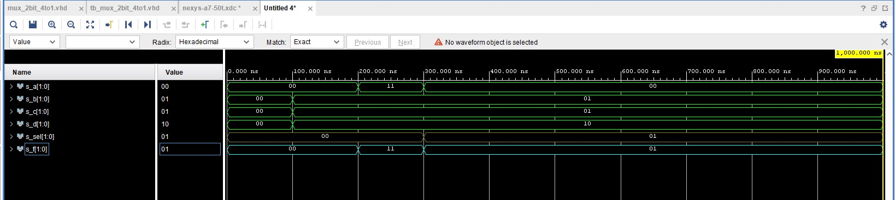

# Labs/03-vivado

## GitHub Link
[GitHub - Daniel Havránek (Dan5049)](https://github.com/Dan5049/Digital-electronics-1)

<br>

## Tables

### Connection table - used in multiplexor

| **Port** | **Switch/LED** | **FPGA package pin** | **FPGA pin** |
| :-: | :-: | :-: | :-: |
| a_i[0] | SW0 | J15 | IO_L24N_T3_RS0_15 |
| a_i[1] | SW1 | L16 | IO_L3N_T0_DQS_EMCCLK_14 |
| b_i[0] | SW2 | M13 | IO_L6N_T0_D08_VREF_14 |
| b_i[1] | SW3 | R15 | IO_L13N_T2_MRCC_14 | 
| c_i[0] | SW4 | R17 | IO_L12N_T1_MRCC_14 |  
| c_i[1] | SW5 | T18 | IO_L7N_T1_D10_14 |  
| d_i[0] | SW6 | U18 | IO_L17N_T2_A13_D29_14 |   
| d_i[1] | SW7 | R13 | IO_L5N_T0_D07_14 |  
| sel_i[0] | SW14 | U11 | IO_L19N_T3_A09_D25_VREF_14 | 
| sel_i[1] | SW15 | V10 | IO_L21P_T3_DQS_14 |
| f_o[0] | LED0 | H17 | IO_L18P_T2_A24_15 |  
| f_o[1] | LED1 | K15 | IO_L24P_T3_RS1_15 |

<br>

### Connection table - Nexys A7-50T

| **Switch name** | **FPGA pin** | **FPGA package pin** |
| :-: | :-: | :-: |
| SW[0] | IO_L24N_T3_RS0_15 |  J15 |
| SW[1] | IO_L3N_T0_DQS_EMCCLK_14 |  L16 |
| SW[2] | IO_L6N_T0_D08_VREF_14 |  M13 |
| SW[3] | IO_L13N_T2_MRCC_14 |  R15 |
| SW[4] | IO_L12N_T1_MRCC_14 |  R17 |
| SW[5] | IO_L7N_T1_D10_14 |  T18 |
| SW[6] | IO_L17N_T2_A13_D29_14 |  U18 |
| SW[7] | IO_L5N_T0_D07_14 |  R13 |
| SW[8] | IO_L24N_T3_34 |  T8 |
| SW[9] | IO_25_34 |  U8 |
| SW[10] | IO_L15P_T2_DQS_RDWR_B_14 |  R16 |
| SW[11] | IO_L23P_T3_A03_D19_14 |  T13 |
| SW[12] | IO_L24P_T3_35 |  H6 |
| SW[13] | IO_L20P_T3_A08_D24_14 |  U12 |
| SW[14] | IO_L19N_T3_A09_D25_VREF_14 |  U11 |
| SW[15] | IO_L21P_T3_DQS_14 |  V10 |

<br>

| **LED Name** | **FPGA pin** | **FPGA package pin name** |
| :-: | :-: | :-: |
| LED[0] | IO_L18P_T2_A24_15 |  H17 |
| LED[1] | IO_L24P_T3_RS1_15 |  K15 |
| LED[2] | IO_L17N_T2_A25_15 |  J13 |
| LED[3] | IO_L8P_T1_D11_14 |  N14 |
| LED[4] | IO_L7P_T1_D09_14 |  R18 |
| LED[5] | IO_L18N_T2_A11_D27_14 |  V17 |
| LED[6] | IO_L17P_T2_A14_D30_14 |  U17 |
| LED[7] | IO_L18P_T2_A12_D28_14 |  U16 |
| LED[8] | IO_L16N_T2_A15_D31_14 |  V16 |
| LED[9] | IO_L14N_T2_SRCC_14 |  T15 |
| LED[10] | IO_L22P_T3_A05_D21_14 |  U14 |
| LED[11] | IO_L15N_T2_DQS_DOUT_CSO_B_14 |  T16 |
| LED[12] | IO_L16P_T2_CSI_B_14 |  V15 |
| LED[13] | IO_L22N_T3_A04_D20_14 |  V14 |
| LED[14] | IO_L20N_T3_A07_D23_14 |  V12 |
| LED[15] | IO_L21N_T3_DQS_A06_D22_14 |  V11 |

<br>

## Two-bit wide 4-to-1 multiplexer
### VHDL architecture
```VHDL
architecture Behavioral of mux_2bit_4to1 is
begin
    f_o <= a_i when (sel_i = "00") else 
           b_i when (sel_i = "01") else
           c_i when (sel_i = "10") else
           d_i;

end architecture Behavioral;
```
 ### VHDL stimulus process
 ```VHDL
 p_stimulus : process
    begin
        -- Report a note at the begining of stimulus process
        report "Stimulus process started" severity note;


        s_d <= "00"; s_c <= "00"; s_b <= "00"; s_a <= "00";
        s_sel <= "00"; wait for 100 ns;
        
        s_d <= "10"; s_c <= "01"; s_b <= "01"; s_a <= "00";
        s_sel <= "00"; wait for 100 ns;
        
        s_d <= "10"; s_c <= "01"; s_b <= "01"; s_a <= "11";
        s_sel <= "00"; wait for 100 ns;
        
        s_d <= "10"; s_c <= "01"; s_b <= "01"; s_a <= "00";
        s_sel <= "01"; wait for 100 ns;
        
        s_d <= "10"; s_c <= "01"; s_b <= "01"; s_a <= "00";
        s_sel <= "01"; wait for 100 ns;
        
       
        wait;
    end process p_stimulus;
 ```
 ### Simulated waveforms
 

<br>

## Vivado tutorial
### New project
1. File - project - new
2. Project name - *name and location*
3. Project type - RTL Project *(others unchecked)*
4. Add Sources - Creat File - File type: VHDL, File name: *project name*, *location empty*
5. Add Constraints - *empty*
6. Default Part - Board - *choose board*
### Add design
1. File - add source - add or create design sources
2. Add or Create Design Sources - Create File - File type: VHDL, File name: *project name*
### Add testbench
1. File - add source - add or create simulation sources
2. Add or Create Design Sources - Create File - File type: VHDL, File name: tb_*project name*
### Add Constraints
1. File - add sources - add or create constraints
2. Add or Create Constraints - Create File - File type: XDC, File name: *board name*
### Simulatiom
1. Flow - Run Simulation - Run Behavioral Simulation
    
    
