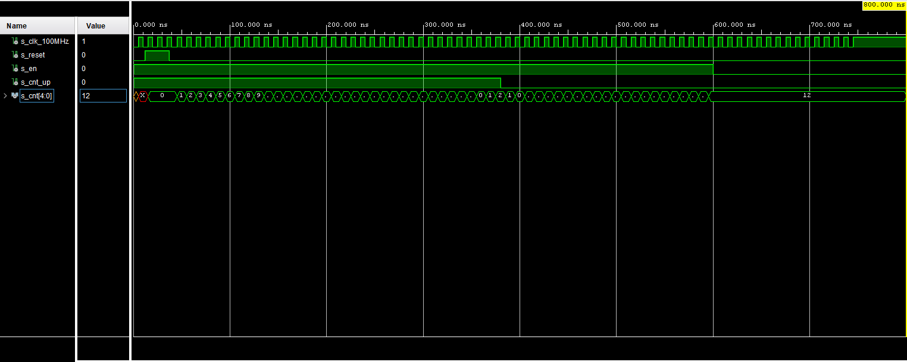
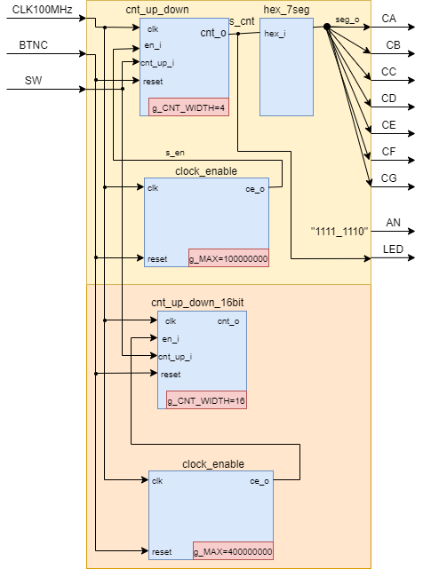

# Labs/04-labs

## GitHub Link
[GitHub - Daniel Havránek (Dan5049)](https://github.com/Dan5049/Digital-electronics-1)

<br>

## 1. Preparation tasks

### Buttons

| **Button** | **FPGA pin** | **FPGA package pin** |
| :-: | :-: | :-: |
| BTNL | IO_L12P_T1_MRCC_14 | P17 |
| BTNR | IO_L10N_T1_D15_14 | M17 |
| BTNU | IO_L4N_T0_D05_14 | M18 |
| BTND | IO_L9N_T1_DQS_D13_14 | P18 |
| BTNC | IO_L9P_T1_DQS_14 | N17 |


<br>

   | **Time interval** | **Number of clk periods** | **Number of clk periods in hex** | **Number of clk periods in binary** |
   | :-: | :-: | :-: | :-: |
   | 2&nbsp;ms | 200 000 | `x"3_0d40"` | `b"0011_0000_1101_0100_0000"` |
   | 4&nbsp;ms | 400 000 | `x"6_1a80"` | `b"0110_0001_1010_1000_0000"` |
   | 10&nbsp;ms | 1 000 000 | `x"f_4240"` | `b"1111_0100_0010_0100_0000"` |
   | 250&nbsp;ms | 25 000 000 | `x"17d_7840"` | `b"0001_0111_1101_0111_1000_0100_0000"` |
   | 500&nbsp;ms | 50 000 000 | `x"2fa_f080"` | `b"0010_1111_1010_1111_0000_1000_0000"` |
   | 1&nbsp;sec | 100 000 000 | `x"5f5_e100"` | `b"0101_1111_0101_1110_0001_0000_0000"` |

<br>

## Bidirectional counter

### Code of the process `p_cnt_up_down`

```VHDL
architecture behavioral of cnt_up_down is

    -- Local counter
    signal s_cnt_local : unsigned(g_CNT_WIDTH - 1 downto 0);

begin
    --------------------------------------------------------------------
    -- p_cnt_up_down:
    -- Clocked process with synchronous reset which implements n-bit 
    -- up/down counter.
    --------------------------------------------------------------------
    p_cnt_up_down : process(clk)
    begin
        if rising_edge(clk) then
        
            if (reset = '1') then               -- Synchronous reset
                s_cnt_local <= (others => '0'); -- Clear all bits

            elsif (en_i = '1') then       -- Test if counter is enabled


                -- TEST COUNTER DIRECTION HERE

                    if (cnt_up_i = '1') then
                        s_cnt_local <= s_cnt_local + 1;
                    else
                        s_cnt_local <= s_cnt_local - 1;            
                    end if;
                
            end if;
        end if;
    end process p_cnt_up_down;

    -- Output must be retyped from "unsigned" to "std_logic_vector"
    cnt_o <= std_logic_vector(s_cnt_local);

end architecture behavioral;

```

<br>

### Reset and stimulus process from testbech

```VHDL
 p_reset_gen : process
    begin
        s_reset <= '0';
        wait for 12 ns;
        
        -- Reset activated
        s_reset <= '1';
        wait for 25 ns;

        s_reset <= '0';
        wait;
    end process p_reset_gen;

    --------------------------------------------------------------------
    -- Data generation process
    --------------------------------------------------------------------
    p_stimulus : process
    begin
        report "Stimulus process started" severity note;

        -- Enable counting
        s_en     <= '1';
        
        -- Change counter direction
        s_cnt_up <= '1';
        wait for 380 ns;
        s_cnt_up <= '0';
        wait for 220 ns;

        -- Disable counting
        s_en     <= '0';

        report "Stimulus process finished" severity note;
        wait;
    end process p_stimulus;
```

<br>

### Simulated waveforms


 <br>


<br>

## Top level

### Code from source file
```VHDL


library IEEE;
use IEEE.STD_LOGIC_1164.ALL;

-- Uncomment the following library declaration if using
-- arithmetic functions with Signed or Unsigned values
--use IEEE.NUMERIC_STD.ALL;

-- Uncomment the following library declaration if instantiating
-- any Xilinx leaf cells in this code.
--library UNISIM;
--use UNISIM.VComponents.all;

entity top is
    Port ( 
    
        CLK100MHz   :       in STD_LOGIC;
        BTNC        :       in STD_LOGIC;
        SW          :       in STD_LOGIC_VECTOR (1 - 1 downto 0);
        LED         :       out STD_LOGIC_VECTOR (4 - 1 downto 0);
        CA          :       out STD_LOGIC;
        CB          :       out STD_LOGIC;
        CC          :       out STD_LOGIC;
        CD          :       out STD_LOGIC;
        CE          :       out STD_LOGIC;
        CF          :       out STD_LOGIC;
        CG          :       out STD_LOGIC;
        AN          :       out STD_LOGIC_VECTOR (8 - 1 downto 0));
end top;

------------------------------------------------------------------------
-- Architecture body for top level
------------------------------------------------------------------------
architecture Behavioral of top is

    -- Internal clock enable
    signal s_en  : std_logic;
    -- Internal counter
    signal s_cnt : std_logic_vector(4 - 1 downto 0);

begin

    --------------------------------------------------------------------
    -- Instance (copy) of clock_enable entity
    clk_en0 : entity work.clock_enable
        generic map(
            --- WRITE YOUR CODE HERE
            g_MAX => 100000000
        )
        port map(
            --- WRITE YOUR CODE HERE
            clk     =>  CLK100MHz,
            reset   =>  BTNC,
            ce_o    =>  s_en
        );

    --------------------------------------------------------------------
    -- Instance (copy) of cnt_up_down entity
    bin_cnt0 : entity work.cnt_up_down
        generic map(
            --- WRITE YOUR CODE HERE
            g_CNT_WIDTH    =>  4
        )
        port map(
            --- WRITE YOUR CODE HERE
            clk         =>  CLK100MHz,
            reset       =>  BTNC,
            en_i        =>  s_en,
            cnt_up_i    =>  SW(0),  
            cnt_o       =>  s_cnt 
        );

    -- Display input value on LEDs
    LED(3 downto 0) <= s_cnt;

    --------------------------------------------------------------------
    -- Instance (copy) of hex_7seg entity
    hex2seg : entity work.hex_7seg
        port map(
            hex_i    => s_cnt,
            seg_o(6) => CA,
            seg_o(5) => CB,
            seg_o(4) => CC,
            seg_o(3) => CD,
            seg_o(2) => CE,
            seg_o(1) => CF,
            seg_o(0) => CG
        );

    -- Connect one common anode to 3.3V
    AN <= b"1111_1110";

end architecture Behavioral;
```

<br>

### Image of he top layer with 4-bit and 16-bit counter

<br>

At the top of the picture, there is 4-bit bidirectional counter connected to 7-segment display. Bellow the 4-bit counter, there is 16-bit bidirectional counter with different time domain. Output of this 16-bit counter is not connected.

<br>



