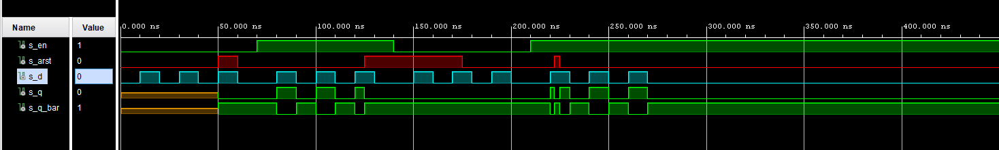

# Labs/07-ffs

## GitHub Link
[GitHub - Daniel Havránek (Dan5049)](https://github.com/Dan5049/Digital-electronics-1)

<br>

## 1. Preparation tasks
### Equations


<br>

### Truth table for D flip-flop

| **clk** | **d** | **q(n)** | **q(n+1)** | **Comments** |
| :-: | :-: | :-: | :-: | :-- |
| ↑ | 0 | 0 | 0 | No change |
| ↑ | 0 | 1 | 0 | No change |
| ↑ | 1 | 0 | 1 | q(n+1)=d if rising edge |
| ↑ | 1 | 1 | 1 | q(n+1)=d if rising edge |

   
<br>

### Truth table for JK flip-flop

   | **clk** | **J** | **K** | **Qn** | **Q(n+1)** | **Comments** |
   | :-: | :-: | :-: | :-: | :-: | :-- |
   | ↑ | 0 | 0 | 0 | 0 | No change |
   | ↑ | 0 | 0 | 1 | 1 | No change |
   | ↑ | 0 | 1 | 0 | 0 | Reset |
   | ↑ | 0 | 1 | 1 | 0 | Reset |
   | ↑ | 1 | 0 | 0 | 1 | Set |
   | ↑ | 1 | 0 | 1 | 1 | Set |
   | ↑ | 1 | 1 | 0 | 1 | Toggle |
   | ↑ | 1 | 1 | 1 | 0 | Toggle |

   
<br>

### Truth table for T flip-flop

| **clk** | **T** | **Qn** | **Q(n+1)** | **Comments** |
| :-: | :-: | :-: | :-: | :-- |
| ↑ | 0 | 0 | 1 | No Change |
| ↑ | 0 | 1 | 0 | No Change |
| ↑ | 1 | 0 | 0 | Invert (Toggle) |
| ↑ | 1 | 1 | 1 | Invert (Toggle) |

<br>

## 2. D latch
### Code of process ```p_d_latch```
```VHDL
architecture Behavioral of d_latch is

begin

    p_d_latch : process (d, arst, en)
    begin
        if (arst = '1') then
            q       <= '0';
            q_bar   <= '1';
        elsif (en = '1') then
             q      <= d;
             q_bar  <= not d;
        end if;
    end process p_d_latch;

end Behavioral;
```
### Testbench

```VHDL
architecture testbench of tb_d_latch is
    
    signal s_en       : std_logic;
    signal s_arst     : std_logic;
    signal s_d        : std_logic;
    signal s_q        : std_logic;
    signal s_q_bar    : std_logic;
    
begin

    uut_d_latch : entity work.d_latch
    port map (
            en     => s_en,
            arst   => s_arst,
            d      => s_d,
            q      => s_q,
            q_bar  => s_q_bar
        );
        
   p_reset_gen : process
   begin
        s_arst <= '0';
        wait for 50 ns;
        
        s_arst <= '1';
        wait for 10 ns;
        
        s_arst <= '0';
        wait for 65 ns;
        
        s_arst <= '1';
        wait for 50 ns;
        
        s_arst <= '0';
        wait for 47 ns;
        
        s_arst <= '1';
        wait for 3 ns;
        
        s_arst <= '0';
        wait;
    end process p_reset_gen;
        
   p_stimulus : process
   begin
        report "Stimulus process started" severity note;
        s_en    <= '0';
        s_d     <= '0';
        
        wait for 10 ns;
        s_d <= '1';
        wait for 10 ns;
        s_d <= '0';
        wait for 10 ns;
        s_d <= '1';
        wait for 10 ns;
        s_d <= '0';
        wait for 10 ns;
        s_d <= '1';
        wait for 10 ns;
        s_d <= '0';
        wait for 10 ns;
        
        s_en <= '1';
        wait for 3 ns;
        
        wait for 7 ns;
        s_d <= '1';
        wait for 10 ns;
        s_d <= '0';
        wait for 10 ns;
        s_d <= '1';
        wait for 10 ns;
        s_d <= '0';
        wait for 10 ns;
        s_d <= '1';
        wait for 10 ns;
        s_d <= '0';
        wait for 10 ns;

        s_en <= '0';
        
        wait for 10 ns;
        s_d <= '1';
        wait for 10 ns;
        s_d <= '0';
        wait for 10 ns;
        s_d <= '1';
        wait for 10 ns;
        s_d <= '0';
        wait for 10 ns;
        s_d <= '1';
        wait for 10 ns;
        s_d <= '0';
        wait for 10 ns;
        
        s_en <= '1';
        
        wait for 10 ns;
        s_d <= '1';
        wait for 10 ns;
        s_d <= '0';
        wait for 10 ns;
        s_d <= '1';
        wait for 10 ns;
        s_d <= '0';
        wait for 10 ns;
        s_d <= '1';
        wait for 10 ns;
        s_d <= '0';
        wait for 10 ns;
        
        report "Stimuluss process end" severity note;
        wait;    
        
    end process p_stimulus;
    
    p_asserts_gen : process
    begin
        report "Start of assert process" severity note;
        wait for 55ns;
        assert(s_arst = '1' and s_q = '0')
        report "Rst" severity error;
        
        wait for 10ns;
        assert(s_arst = '0' and s_q = '0')
        report "Out" severity error;
        
        wait for 10ns;
        assert(s_arst = '0' and s_q = '0')
        report "Out" severity error;
        
        wait for 10ns;
        assert(s_arst = '0' and s_q = '1')
        report "Out" severity error;
        
        wait for 43ns;
        assert(s_arst = '1' and s_q = '0')
        report "Rst" severity error;
        
        wait for 7ns;
        assert(s_arst = '1' and s_q = '0')
        report "Rst" severity error;
        
        wait for 10ns;
        assert(s_arst = '1' and s_q = '0')
        report "Rst" severity error;
        
        wait for 50ns;
        assert(s_arst = '0' and s_q = '0')
        report "Out" severity error;
        
        
        
        report "End of assert process" severity note;
        wait;
    end process p_asserts_gen; 

end architecture testbench;
```

<br>

### Simulated waveforms


<br>

## 3. Flip-flops
### Processes
#### Asynchronní reset D
```VHDL
    p_d_ff_arst : process (clk, arst)
    begin
        if (arst = '1') then
             q       <= '0';
             q_bar   <= '1';
        elsif rising_edge (clk) then
             q      <= d;
             q_bar  <= not d;
        end if;
    end process p_d_ff_arst;
```
#### Synchronní reset D
```VHDL
   p_d_ff_rst : process (clk)
   begin
        if rising_edge(clk) then
            if (rst = '1') then
                q       <= '0';
                q_bar   <= '1';
            else
                q       <= d;
                q_bar   <= not d;
            end if;
        end if;
    end process p_d_ff_rst;
```
### JK
```VHDL
architecture Behavioral of jk_ff_rst is
    signal s_q      : std_logic;
begin
    p_jk_ff_rst : process (clk)
    begin
        if rising_edge(clk) then
            if (rst = '1') then
                s_q       <= '0';
            else
                if (j = '0' and k = '0') then
                        s_q <= s_q;
                elsif (j = '0' and k = '1') then
                        s_q <= '0';
                elsif (j = '1' and k = '0') then
                        s_q <= '1';
                elsif (j = '1' and k = '1') then
                        s_q <= not s_q;
                end if;               
            end if;
        end if;     
    end process p_jk_ff_rst;
    
    q       <= s_q;
    q_bar   <= not s_q;

end Behavioral;
```
### T
```VHDL
architecture Behavioral of t_ff_rst is
    signal s_q : std_logic;
begin
 p_t_ff_rst : process (clk)
    begin
        if rising_edge(clk) then
            if (rst = '1') then
                s_q       <= '0';
            else
                if (t = '0') then
                    s_q   <= s_q;
                else
                    s_q   <= not s_q; 
               end if;
            end if;
        end if;     
    end process p_t_ff_rst;
    q       <= s_q;
    q_bar   <= not s_q;
end Behavioral;
```

<br>

### Testbench

#### Asynchronní reset D
```VHDL
architecture Behavioral of tb_d_ff_arst is

        constant c_clk : time    := 10 ns;
        
        signal s_clk     : std_logic;
        signal s_arst    : std_logic;
        signal s_d       : std_logic;
        signal s_q       : std_logic;
        signal s_q_bar   : std_logic;
begin

    uut_d_ff_arst : entity work.d_ff_arst
    port map(
            clk   => s_clk,   
            arst  => s_arst, 
            d     => s_d,    
            q     => s_q,    
            q_bar => s_q_bar
        );
    
    p_arst : process
    begin
            s_arst <= '0';
            wait for 52 ns;
            
            s_arst <= '1';
            wait for 8 ns;
    
            s_arst <= '0';
            wait for 150 ns;
            
            s_arst <= '1';
            wait for 58 ns;
            
            s_arst <= '0';
            wait for 20ns;
            
            s_arst <= '1';
            wait;
            
    end process p_arst;
    
    p_clk_gen : process
    begin
            while now < 750 ns loop         -- 75 periods of 100MHz clock
                s_clk <= '0';
                wait for c_clk / 2;
                s_clk <= '1';
                wait for c_clk / 2;
            end loop;
        wait;
    end process p_clk_gen;
    
    p_stimulus : process
    begin
            report "Stimulus process started" severity note;
            
            wait for 13 ns;
            s_d  <= '1';
            wait for 10 ns;
            s_d  <= '0';
            wait for 10 ns;
            s_d  <= '1';
            wait for 10 ns;
            s_d  <= '0';
            wait for 10 ns;
            s_d  <= '1';
            wait for 10 ns;
            s_d  <= '0';
            
            report "Stimulus process started" severity note;
    end process p_stimulus;
    
    p_asserts_gen : process
    begin
        report "Start of assert process" severity note;
        wait for 18ns;
        assert(s_arst = '0' and s_clk = '1' and s_q = '1')
        report "Out" severity error;
        
        wait for 39ns;
        assert(s_arst = '1' and s_clk = '1' and s_q = '0')
        report "Rst" severity error;
        
        wait for 45ns;
        assert(s_arst = '0' and s_clk = '0' and s_q = '0')
        report "Out" severity error;
        
        wait for 121ns;
        assert(s_arst = '1' and s_clk = '0' and s_q = '0')
        report "Rst" severity error;
        wait;
        report "End of assert process" severity note;
    end process p_asserts_gen;

end Behavioral;
```
#### Synchronní reset D
```VHDL
architecture Behavioral of tb_d_ff_rst is

        constant c_clk : time    := 10 ns;
        
        signal s_clk     : std_logic;
        signal s_rst     : std_logic;
        signal s_d       : std_logic;
        signal s_q       : std_logic;
        signal s_q_bar   : std_logic;

begin

    uut_d_ff_rst : entity work.d_ff_rst
    port map(
            clk   => s_clk,   
            rst   => s_rst, 
            d     => s_d,    
            q     => s_q,    
            q_bar => s_q_bar
        );
        
     p_clk_gen : process
     begin
            while now < 750 ns loop
                s_clk <= '0';
                wait for c_clk / 2;
                s_clk <= '1';
                wait for c_clk / 2;
            end loop;
        wait;
    end process p_clk_gen;
    
    p_rst_gen : process
    begin
        s_rst <= '0';
        wait for 19ns;
        s_rst <= '1';
        wait for 20ns;
        s_rst <= '0';
        wait for 158ns;
        s_rst <= '1';
        wait for 97ns;
        s_rst <= '1';
        wait;
        
     end process p_rst_gen;   

     p_stimulus : process
     begin
            report "Stimulus process started" severity note;
            
            wait for 13 ns;
            s_d  <= '1';
            wait for 10 ns;
            s_d  <= '0';
            wait for 10 ns;
            s_d  <= '1';
            wait for 10 ns;
            s_d  <= '0';
            wait for 10 ns;
            s_d  <= '1';
            wait for 10 ns;
            s_d  <= '0';
            
            report "Stimulus process started" severity note;
    end process p_stimulus;
    
    p_asserts_gen : process
    begin
        report "Start of assert process" severity note;
        wait for 27ns;
        assert(s_rst = '1' and s_clk = '1' and s_q = '0')
        report "Rst" severity error;
        
        wait for 6ns;
        assert(s_rst = '1' and s_clk = '0' and s_q = '0')
        report "Rst" severity error;
        
        wait for 25ns;
        assert(s_rst = '0' and s_clk = '1' and s_q = '1')
        report "Out" severity error;
        
        wait for 14ns;
        assert(s_rst = '0' and s_clk = '0' and s_q = '0')
        report "Out" severity error;
        wait;
        report "End of assert process" severity note;
    end process p_asserts_gen;
end Behavioral;
```
### JK
```VHDL
architecture Behavioral of tb_jk_ff_rst is
        constant c_clk : time    := 10 ns;
 
        signal s_clk     : std_logic;
        signal s_rst     : std_logic;
        signal s_j       : std_logic;
        signal s_k       : std_logic;
        signal s_q       : std_logic;
        signal s_q_bar   : std_logic;
begin

    uut_jk_ff_rst : entity work.jk_ff_rst
        port map(
            clk   => s_clk,   
            rst   => s_rst, 
            j     => s_j,    
            k     => s_k,    
            q     => s_q,    
            q_bar => s_q_bar
        );
 
    p_rst : process
    begin
            s_rst <= '0';
            wait for 322 ns;
 
            s_rst <= '1';
            wait for 1 ns;
 
            s_rst <= '0';
            wait for 4 ns;
            
            s_rst <= '1';
            wait for 1 ns;
 
            s_rst <= '0';
            wait for 20 ns;
 
            s_rst <= '1';
            wait;
    end process p_rst;
 
    p_clk_gen : process
    begin
            while now < 750 ns loop         -- 75 periods of 100MHz clock
                s_clk <= '0';
                wait for c_clk / 2;
                s_clk <= '1';
                wait for c_clk / 2;
            end loop;
        wait;
    end process p_clk_gen;
 
    p_stimulus : process
    begin
            report "Stimulus process started" severity note;
            for I in 0 to 4 loop
                wait for 13 ns; --reset
                s_j  <= '0';
                s_k  <= '1';
                wait for 10 ns; --set
                s_j  <= '1';
                s_k  <= '0';
                wait for 10 ns; --no change
                s_j  <= '0';
                s_k  <= '0';
                wait for 10 ns; --togle
                s_j  <= '1';
                s_k  <= '1';
                
                wait for 10 ns; --reset
                s_j  <= '0';
                s_k  <= '1';
                 wait for 10 ns; --no change
                s_j  <= '0';
                s_k  <= '0';
                wait for 10 ns; --togle
                s_j  <= '1';
                s_k  <= '1';
                wait for 10 ns; --set
                s_j  <= '1';
                s_k  <= '0';
                wait for 10 ns; --reset
                s_j  <= '0';
              
           end loop;
           report "Stimulus process ended" severity note;
           wait;
    end process p_stimulus;
    
    p_asserts_gen : process
    begin
        report "Start of assert process" severity note;        
        wait for 48ns;
        assert(s_rst = '0' and s_clk = '1' and s_q = '0')
        report "Out" severity error;
        
        wait for 30ns;
        assert(s_rst = '0' and s_clk = '1' and s_q = '1')
        report "Out" severity error;
        
        wait for 64ns;
        assert(s_rst = '0' and s_clk = '0' and s_q = '1')
        report "Out" severity error;
        
        wait for 51ns;
        assert(s_rst = '0' and s_clk = '0' and s_q = '1')
        report "Out" severity error;
        
         wait for 164ns;
        assert(s_rst = '1' and s_clk = '1' and s_q = '0') --357
        report "Rst" severity error;
        
        wait for 6ns;
        assert(s_rst = '1' and s_clk = '0' and s_q = '0') --363
        report "Rst" severity error;
        
        wait;
        report "End of assert process" severity note;
    end process p_asserts_gen;
end Behavioral;
```
### T
```VHDL
architecture Behavioral of tb_t_ff_rst is
        constant c_clk : time    := 10 ns;
 
        signal s_clk     : std_logic;
        signal s_rst     : std_logic;
        signal s_t       : std_logic;
        signal s_q       : std_logic;
        signal s_q_bar   : std_logic;
begin

    uut_t_ff_rst : entity work.t_ff_rst
     port map(
            clk   => s_clk,   
            rst   => s_rst, 
            t     => s_t,    
            q     => s_q,    
            q_bar => s_q_bar
        );
        
    p_rst : process
    begin
         s_rst <= '0';
         wait for 10ns;
         s_rst <= '1';
         wait for 10ns;
         s_rst <= '0';
         wait for 322 ns;
 
         s_rst <= '1';
         wait for 1 ns;
         s_rst <= '0';
         wait for 4 ns;
         s_rst <= '1';
         wait for 1 ns;
         s_rst <= '0';
         wait for 20 ns;
 
         s_rst <= '1';
         wait;
    end process p_rst;
    
    p_clk_gen : process
    begin
            while now < 750 ns loop         -- 75 periods of 100MHz clock
                s_clk <= '0';
                wait for c_clk / 2;
                s_clk <= '1';
                wait for c_clk / 2;
            end loop;
        wait;
    end process p_clk_gen;
    
    p_stimulus : process
        begin
            report "Stimulus process started" severity note;
            for I in 0 to 10 loop
                wait for 34 ns;
                s_t  <= '1';
                wait for 10ns;
                s_t <= '0';
                wait for 10ns;
                s_t <= '1';
                wait for 10ns;
                s_t <= '0';
               
           end loop;
           report "Stimulus process ended" severity note;
           wait;
    end process p_stimulus;
    
    p_asserts_gen : process
    begin
        report "Start of assert process" severity note;        
        wait for 58ns;
        assert(s_rst = '0' and s_clk = '1' and s_q = '1')
        report "Out" severity error;
        
        wait for 15ns;
        assert(s_rst = '0' and s_clk = '0' and s_q = '1')
        report "Out" severity error;
        
        wait for 40ns;
        assert(s_rst = '0' and s_clk = '0' and s_q = '0')
        report "Out" severity error;
        
        wait for 65ns;
        assert(s_rst = '0' and s_clk = '1' and s_q = '0')
        report "Out" severity error;
        
         wait for 200ns;
        assert(s_rst = '1' and s_clk = '1' and s_q = '0') --357
        report "Rst" severity error;
        
        wait for 15ns;
        assert(s_rst = '1' and s_clk = '0' and s_q = '0') --363
        report "Rst" severity error;
        
        wait;
        report "End of assert process" severity note;
    end process p_asserts_gen;
end Behavioral;
```

<br>

### Simulated waveforms
#### Asynchronní D

#### Synchronní D

#### JK

#### T


## 4. Shift register


