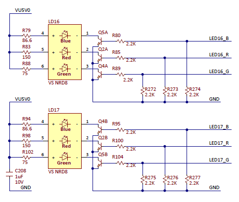
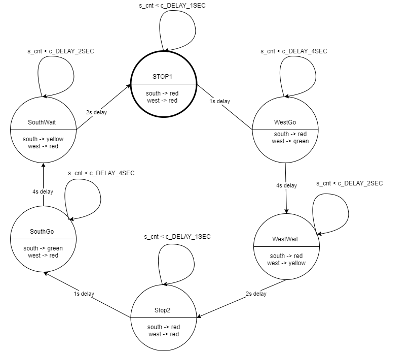
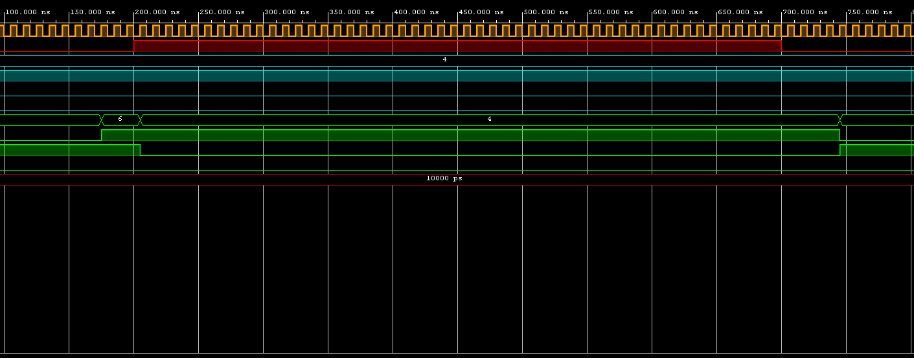
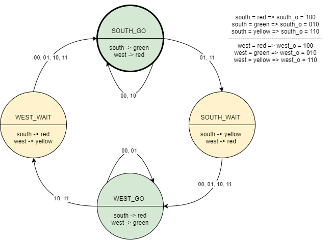

# Labs/08-traffic_lights

## GitHub Link
[GitHub - Daniel Havránek (Dan5049)](https://github.com/Dan5049/Digital-electronics-1)

<br>

## 1. Preparation tasks

### State table
| **Input P** | `0` | `0` | `1` | `1` | `0` | `1` | `0` | `1` | `1` | `1` | `1` | `0` | `0` | `1` | `1` | `1` |
| :-- | :-: | :-: | :-: | :-: | :-: | :-: | :-: | :-: | :-: | :-: | :-: | :-: | :-: | :-: | :-: | :-: |
| **Clock** | ↑ | ↑ | ↑ | ↑ | ↑ | ↑ | ↑ | ↑ | ↑ | ↑ | ↑ | ↑ | ↑ | ↑ | ↑ | ↑ |
| **State** | A | A | B | C | C | D | A | B | C | D | B | B | B | C | D | B |
| **Output R** | `0` | `0` | `0` | `0` | `0` | `1` | `0` | `0` | `0` | `1` | `0` | `0` | `0` | `0` | `1` | `0` |

<br>

### Schematic of RGB LEDs connection


<br>

### RGB LEDs connection and control
| **RGB LED** | **Artix-7 pin names** | **Red** | **Yellow** | **Green** |
| :-: | :-: | :-: | :-: | :-: |
| LD16 | N15, M16, R12 | `1,0,0` | `1,1,0` | `0,1,0` |
| LD17 | N16, R11, G14 | `1,0,0` | `1,1,0` | `0,1,0` |

<br>

## 2. Traffic light controller
### State diagram


<br>

### Sequential process
```VHDL
p_traffic_fsm : process(clk)
    begin
        if rising_edge(clk) then
            if (reset = '1') then       -- Synchronous reset
                s_state <= STOP1 ;      -- Set initial state
                s_cnt   <= c_ZERO;      -- Clear all bits

            elsif (s_en = '1') then
                -- Every 250 ms, CASE checks the value of the s_state 
                -- variable and changes to the next state according 
                -- to the delay value.
                case s_state is

                    -- If the current state is STOP1, then wait 1 sec
                    -- and move to the next GO_WAIT state.
                    when STOP1 =>
                        -- Count up to c_DELAY_1SEC
                        if (s_cnt < c_DELAY_1SEC) then
                            s_cnt <= s_cnt + 1;
                        else
                            -- Move to the next state
                            s_state <= WEST_GO;
                            -- Reset local counter value
                            s_cnt   <= c_ZERO;
                        end if;

                    when WEST_GO =>
                        -- WRITE YOUR CODE HERE
                         if (s_cnt < c_DELAY_GO) then
                            s_cnt <= s_cnt + 1;
                        else
                            s_state <= WEST_WAIT;
                            s_cnt   <= c_ZERO;
                        end if;

                    when WEST_WAIT =>
                         if (s_cnt < c_DELAY_WAIT) then
                            s_cnt <= s_cnt + 1;
                        else
                            s_state <= STOP2;
                            s_cnt   <= c_ZERO;
                        end if;
                        
                    when STOP2 =>
                         if (s_cnt < c_DELAY_1SEC) then
                            s_cnt <= s_cnt + 1;
                        else
                            s_state <= SOUTH_GO;
                            s_cnt   <= c_ZERO;
                        end if;
                        

                   when SOUTH_GO =>
                         if (s_cnt < c_DELAY_GO) then
                            s_cnt <= s_cnt + 1;
                        else
                            s_state <= SOUTH_WAIT;
                            s_cnt   <= c_ZERO;
                        end if;
                        
                   when SOUTH_WAIT =>
                         if (s_cnt < c_DELAY_WAIT) then
                            s_cnt <= s_cnt + 1;
                        else
                            s_state <= STOP1;
                            s_cnt   <= c_ZERO;
                        end if;

                    -- It is a good programming practice to use the 
                    -- OTHERS clause, even if all CASE choices have 
                    -- been made. 
                    when others =>
                        s_state <= STOP1;

                end case;
            end if; -- Synchronous reset
        end if; -- Rising edge
    end process p_traffic_fsm;
```

<br>

### Combinatorial process
```VHDL
 p_output_fsm : process(s_state)
    begin
        case s_state is
            when STOP1 =>
                south_o <= "100";   -- Red (RGB = 100)
                west_o  <= "100";   -- Red (RGB = 100)
            when WEST_GO =>
                -- WRITE YOUR CODE HERE
                south_o <= "100";   -- Red (RGB = 100)
                west_o  <= "010";   -- Green (RGB = 010)
            when WEST_WAIT =>
                -- WRITE YOUR CODE HERE
                south_o <= "100";   -- Red (RGB = 100)
                west_o  <= "110";   -- Yellow (RGB = 110)
            when STOP2 =>
                -- WRITE YOUR CODE HERE
                south_o <= "100";   -- Red (RGB = 100)
                west_o  <= "100";   -- Red (RGB = 100)  
            when SOUTH_GO =>
                -- WRITE YOUR CODE HERE
                south_o <= "010";   -- Green (RGB = 010)
                west_o  <= "100";   -- Red (RGB = 100)
           when SOUTH_WAIT =>
                -- WRITE YOUR CODE HERE
                south_o <= "110";   -- Yellow (RGB = 110)
                west_o  <= "100";   -- Red (RGB = 100)                                            
             
            when others =>
                south_o <= "100";   -- Red
                west_o  <= "100";   -- Red
        end case;
    end process p_output_fsm;
```

<br>

### Simulation screenshots


<br>

 

<br>

## 3. Smart controller

### State table - actual state
| **State number** | **State name** | **Output S,W** | **No cars** | **Only west** | **Only south** |**Both** |  
| :-: | :-: | :-: | :-: | :-: | :-: | :-: |
| 0 | `SOUTH_GO` | `010, 100` | `SOUTH_GO` | `SOUTH_WAIT` | `SOUTH_GO` | `SOUTH_WAIT` |
| 1 | `SOUTH_WAIT` | `110, 100` | `WEST_GO` | `WEST_GO` | `WEST_GO` | `WEST_GO` |
| 2 | `WEST_GO` | `100, 010` | `WEST_GO` | `WEST_GO` | `WEST_WAIT` | `WEST_WAIT` |
| 3 | `WEST_WAIT` | `100, 110` | `SOUTH_GO` | `SOUTH_GO` | `SOUTH_GO` | `SOUTH_GO` |
| *Actual state ->* |  |  | *Next state ->* |  |  |  |

<br>

### State diagram


<br>

### Sequential process
```VHDL
p_smart_traffic_fsm : process(clk)
    begin
        if rising_edge(clk) then
            if (reset = '1') then        -- Synchronous reset
                s_state <= SOUTH_GO;     -- Set initial state
                s_cnt   <= c_DELAY_ZERO; -- Clear all bits

            elsif (s_en = '1') then
                -- Every 250 ms, CASE checks the value of the s_state 
                -- variable and changes to the next state according 
                -- to the delay value.
                case s_state is

                    -- If the current state is STOP1, then wait 1 sec
                    -- and move to the next GO_WAIT state.
                    when SOUTH_GO =>
                        -- Count up to c_DELAY_1SEC
                        if (s_cnt < c_DELAY_GO and (sensor_i = "00" or sensor_i = "10")) then
                            s_cnt <= s_cnt + 1;
                        else
                            -- Move to the next state
                            s_state <= SOUTH_WAIT;
                            -- Reset local counter value
                            s_cnt   <= c_DELAY_ZERO;
                        end if;

                    when SOUTH_WAIT =>
                        if (s_cnt < c_DELAY_WAIT) then
                            s_cnt <= s_cnt + 1;
                        else
                            s_state <= WEST_GO;
                            s_cnt <= c_DELAY_ZERO;
                        end if;

                    when WEST_GO =>
                        if (s_cnt < c_DELAY_GO and (sensor_i = "00" or sensor_i = "01")) then
                            s_cnt <= s_cnt + 1;
                        else
                            s_state <= WEST_WAIT;
                            s_cnt <= c_DELAY_ZERO;
                        end if;
                        
                    when WEST_WAIT =>
                        if (s_cnt < c_DELAY_WAIT) then
                            s_cnt <= s_cnt + 1;
                        else
                            s_state <= SOUTH_GO;
                            s_cnt <= c_DELAY_ZERO;
                        end if;

                    -- It is a good programming practice to use the 
                    -- OTHERS clause, even if all CASE choices have 
                    -- been made. 
                    when others =>
                        s_state <= SOUTH_GO;

                end case;
            end if; -- Synchronous reset
        end if; -- Rising edge
    end process p_smart_traffic_fsm;
```